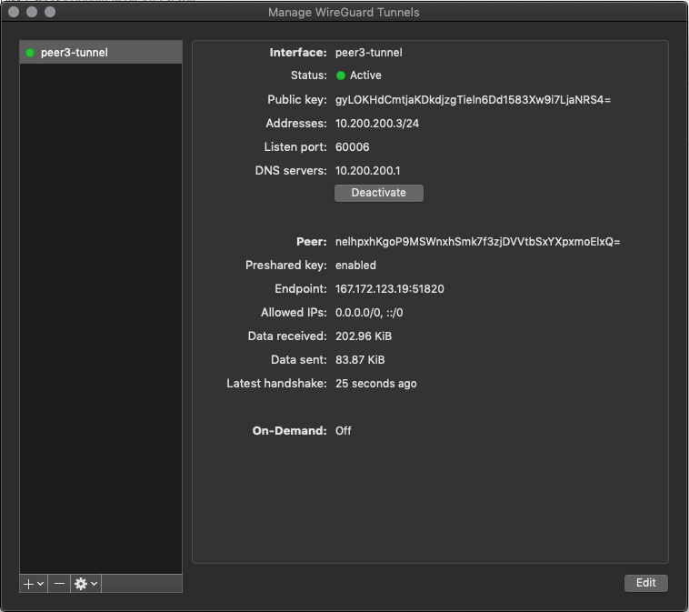

Run a personal VPN in the cloud. And _rotate_ it regularly.

VPN servers are a great way to hide your activity from the prying eyes of ISPs
and obfuscate your location. But it's better to run your own VPN than to pay
for a service, since the VPN service may be tracking you too. However, setting
up a VPN is difficult. Add to that, it's probably wise to change the IP address
of your VPN after a while. Usually, this means tearing the existing server down
and standing up a new one in its place.

**rotvpn** is a pure Python utility that sets up a
[WireGuard](https://github.com/WireGuard/WireGuard) full tunnel VPN with DNS (via
[unbound](https://github.com/NLnetLabs/unbound)). It is designed to be
ephemeral, so you can rotate to a new server with a single command.

_Currently, only [DigitalOcean](https://digitalocean.com) is supported since
they have a great API -- but other providers may be added in the future._

# Installation

**rotvpn** installs and runs from your workstation.

You must have `python3` in your path. You will need to create a virtual
environment and install the dependencies:

```
python3 -m virtualenv --python="$(command -v python3)" .env        # create the virtualenv
source .env/bin/activate                                           # start it up
python3 -m pip install -r requirements.txt                         # install requirements
```

Once that's done, you'll need to get a [DigitalOcean API token](https://cloud.digitalocean.com/account/api/tokens). Export it into your environment:

```
export DO_TOKEN=123abc...
```

and you're ready to go. Make sure you're running in your virtualenv, and in the
root of this repo. Then do something like

```
python3 rotvpn.py --name my-cool-vpn
```

After the script runs, you should have a file named `peer-tunnel-configs.zip`.
Unzip and you will have 10 peer configurations.


Here is the usage for the script:

```
> python3 rotvpn.py --help

usage: rotvpn.py [-h] [--provider PROVIDER] [--name NAME] [--do DO]
                 [--config CONFIG]

optional arguments:
  -h, --help           show this help message and exit
  --provider PROVIDER  Specify the provider, i.e. digitalocean
  --name NAME          A name for your deploy, like 'mycoolvpn'. Lets you have
                       multiple deploys for a provider.
  --do DO              Provision or remove your VPN: --do provision | --do
                       remove
  --config CONFIG      Optional JSON config for your provider

```

The `--name` parameter is the only one that is required. **rotvpn** defaults to
DigitalOcean for `--provider` and the default `--do` action is `provision`. Any
time you run the prior command, any existing server matching `--name` will be
deleted, and a new server deployed with a new set of client configs
(`peer-tunnel-configs.zip`)

Providers may have additional configuration fields they accept. If they do, you
can use the `--config` parameter to pass in that information. For instance, the
DigitalOcean provider defaults to the `sfo2` region, and the `s-1vcpu-2gb`
(smallest) sized droplet. If you want to change that, you can do something like:

```
python3 rotvpn.py --name my-cool-vpn --config '{"region":"nyc3","size":"s-1vcpu-2gb"}'
```

If you're done with the VPN for a while, you can simply remove it, and save
some money until you need it again:

```
python3 rotvpn.py --name my-cool-vpn --do remove
```

# Client configuration

## MacOS

Install the [WireGuard](https://apps.apple.com/us/app/wireguard/id1451685025?mt=12) client from the App Store.

Open it and click 'Import tunnel(s) from file'.

Select one of the files unzipped from `peer-tunnel-configs.zip`.

It will load in your WireGuard client interface:



Click 'Activate'. Test your connection and IP address.

# References

Much was learned from these posts:

1. https://craighuther.com/2019/05/14/wireguard-setup-and-installation/
1. https://www.ckn.io/blog/2017/11/14/wireguard-vpn-typical-setup/
1. https://www.stavros.io/posts/how-to-configure-wireguard/
1. https://emanuelduss.ch/2018/09/wireguard-vpn-road-warrior-setup/

